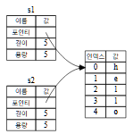

# 소유권
⭐ 러스트의 핵심적인 기능으로 러스트 프로그램의 메모리 관리법을 지배하는 규칙 모음이다.
1. 러스트는 GC가 없다.
   러스트는 현대 언어에서 많이 채택하는 GC가 없고 C언어처럼 직접적인 메모리 해제가 없다.
   러스트는 독특하게 "소유권"이라는 시스템을 채택하였다.
   러스트의 컴파일러는 매우 막강한 권력으로 컴파일을 할 때 메모리 사용 위치 등을 모두 찾고
   적절한 위치에서 메모리 해제 코드를 생성한다.
2. 소유권의 주요 대상은 "힙"이다.
3. 소유권 규칙
   1) 러스트에서 각각의 값은 "소유자"가 정해져 있다.
   2) 한 값의 소유자는 동시에 여럿 존재할 수 없다.
   3) 소유자가 스코프 밖으로 벗어날 때 값은 버려진다.(dropped)
4. 변수는 스코프내에 나타나면 유효하며 벗어나면 유효하지 않다.
5. 러스트는 변수가 스코프 밖으로 벗어나면 [drop]이라는 특별 함수를 호출한다.
   [drop] 함수로 개발자가 직접 메모리 해제 코드를 작성할 수 있다.
   C++의 RAII 패턴과 유사하다고 한다.
6. 변수 상호작용 방식 : 이동   
   
   코드상에 s2는 s1을 "복사"한다. 같은 포인터를 보는것이다.
   그리고 s2와 s1이 스코프에서 벗어나면 "중복 해제" 에러가 발생한다.
   만약 해당 코드를 컴파일시 [clone]을 이용하라고 한다.
   즉 러스트에서는 깊은 복사를 사용해야 한다.